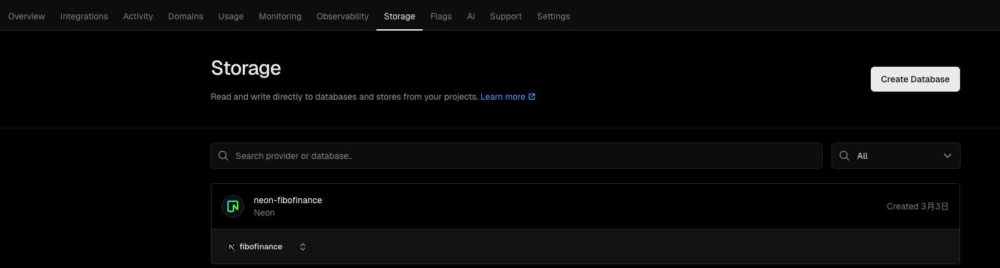
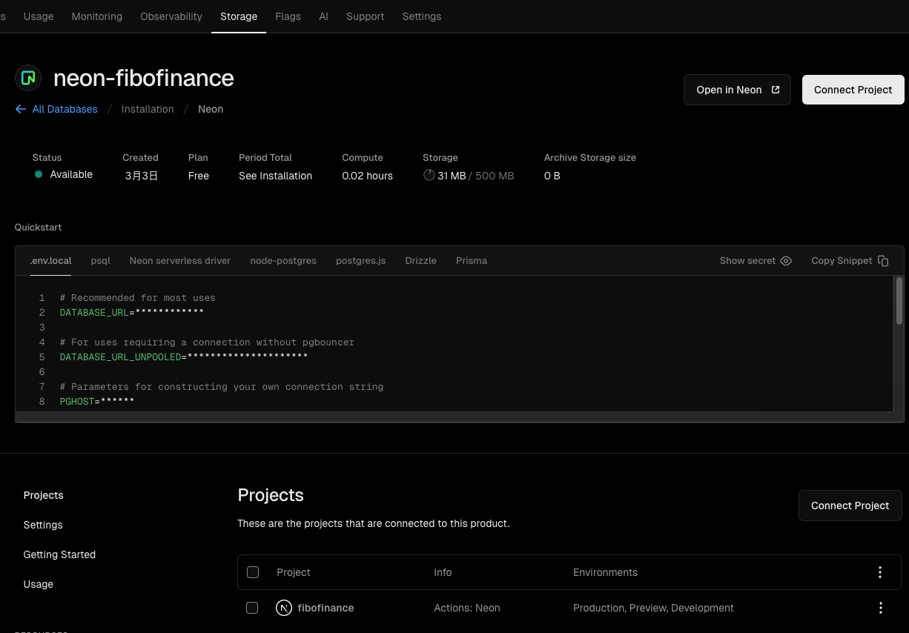
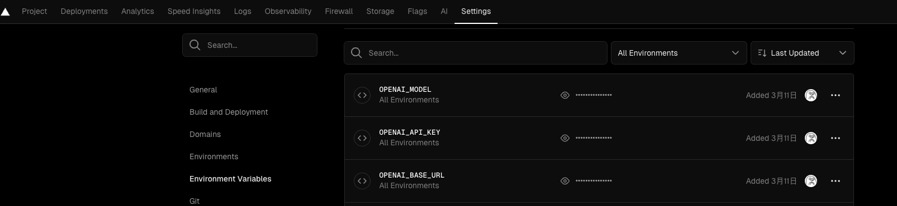

# FiboFinance

斐波纳财(FiboFinance) 是一个个人资产记录应用，可以通过 AI 分析你的资产情况，并给出资产配置建议。

## ✨ 功能

- **智能资产配置** - 基于黄金比例原则使用AI优化你的资产配置
- **支持资产分组** - 支持配置多组资产，私房钱也可单独管理
- **资产趋势查看** - 简洁图表展示资产变化趋势，轻松跟踪每月收支
- **数据泄露保护** - 私有部署，数据不泄露

## 🚀 快速开始

### Vercel 一键部署

### 新增数据库

在 vercel 中添加 nero 数据库

### 连接数据库

点击 connect database 按钮，选择你的 fibofinance 项目

### 配置 AI 模型（可选，不配置则无法使用 AI 分析功能）

在 vercel env 中配置 OpenAI api 或任何其他兼容 OpenAI api 的模型（豆包、deepseek、claude 等）

需配置：

- OPENAI_BASE_URL
- OPENAI_API_KEY
- OPENAI_MODEL

## 🙏 鸣谢

- [Next.js](https://nextjs.org/)
- [OpenAI](https://openai.com/)
- [HeroUI](https://github.com/heroui)
