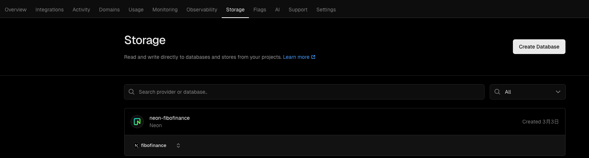
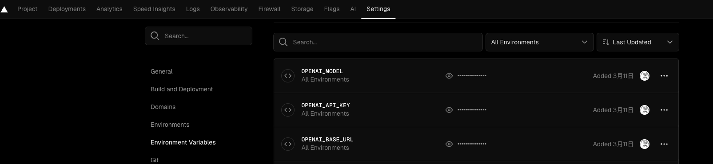

# FiboFinance


[English](./README.md) | [简体中文](./README_ZH.md)

FiboFinance is a lightweight, self-hosted asset tracking app: record assets, view trends and allocation, and get AI analysis when needed.

## Highlights

- Self-hosted, data-secure, and password-protected
- Supports group management
- Multi-currency support with custom exchange rates (silver, gold, and similar assets can be recorded by gram and automatically converted to CNY)
- Supports trend charts, allocation pie charts, and history records
- Supports AI analysis

## Deployment

One-click deployment on Vercel

[](https://vercel.com/new/clone?repository-url=https://github.com/emiyaaaaa/fibofinance)

Create a Neon database


Connect the database


Configure AI analysis (optional)


Database initialization runs during the build process, so deployment may fail if the database is not connected. If that happens, connect the database and redeploy.

## Local Development

Configure `.env.local`

```bash
DATABASE_URL="postgres://..."
OPENAI_API_KEY="" # Optional
OPENAI_MODEL="" # Optional
OPENAI_BASE_URL="" # Optional
```

Start the app

```bash
npm install

npm run dev
```

## License

[MIT](./LICENSE)
