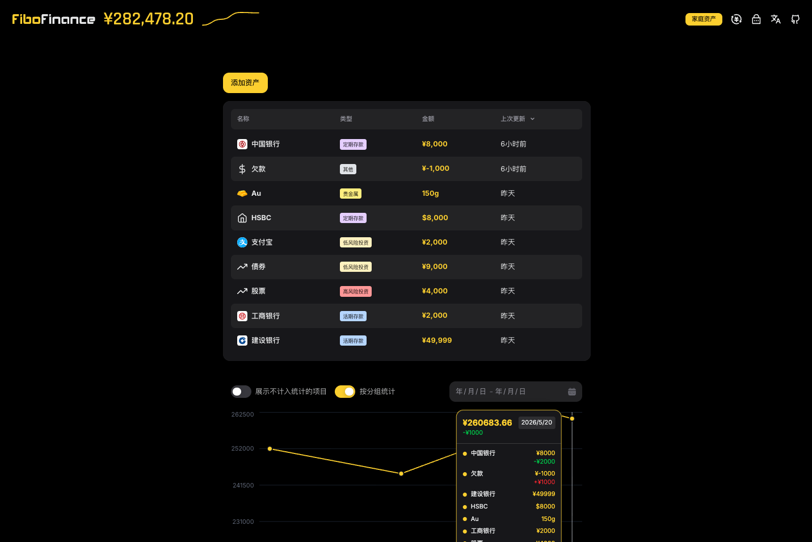
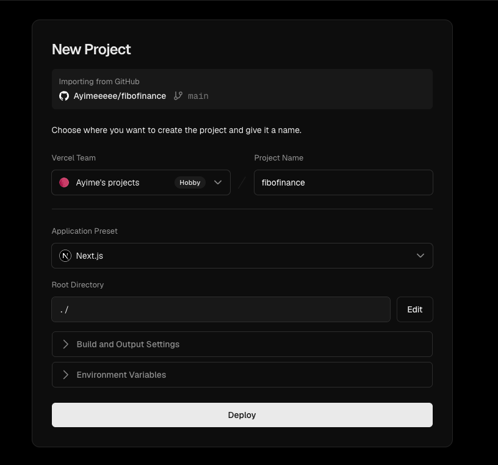
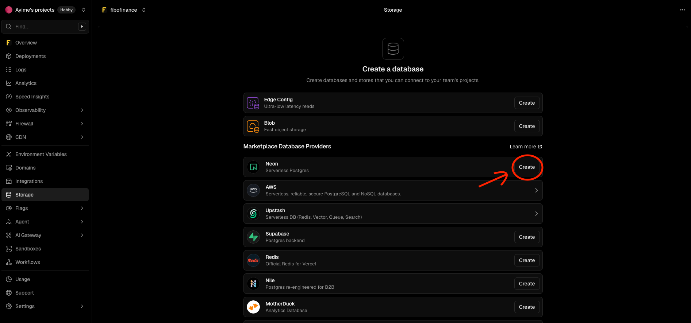
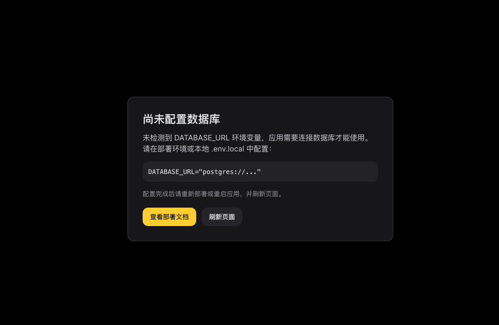
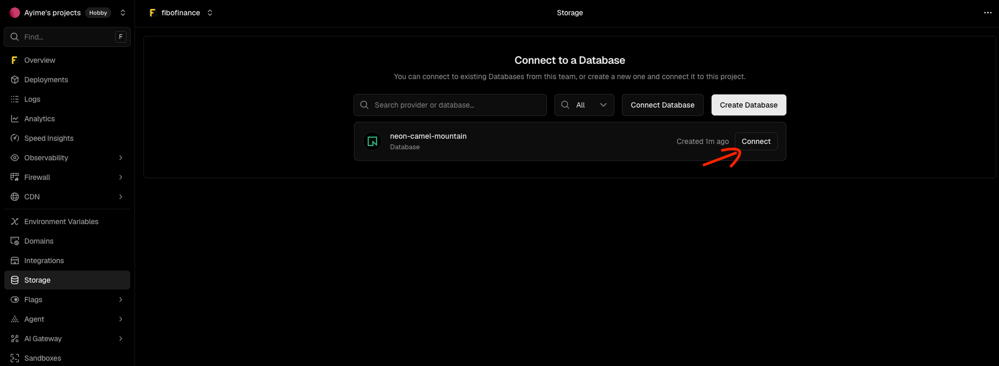
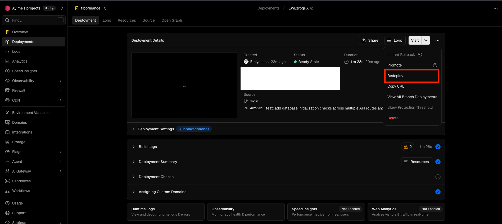
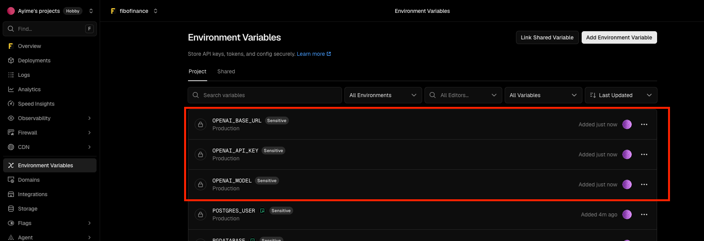

<p align="center">
  <br/>
  <picture>
    <source media="(prefers-color-scheme: dark)" srcset="./public/logo-dark.svg" width="60%">
    <source media="(prefers-color-scheme: light)" srcset="./public/logo-light.svg" width="60%">
    
  </picture>
  <br/>
  <br/>
  <p align="center">
    
    
    
  </p>
  
</p>

[English](./README_EN.md) | [简体中文](./README.md)

FiboFinance 是一个轻量的自部署资产记录应用，通过记录资产当前值的方式来追踪资产变化，告别传统记账模式。

## Demo

https://fibofinance.cn

## 亮点

- 便捷部署、数据安全、密码保护
- 支持分组管理
- 多币种支持、自定义汇率（白银、黄金等按克记录，自动转换为人民币）
- 支持趋势图、配置饼图、灵活对比资产变化
- 支持 AI 分析

## 部署

Vercel 一键部署（不推荐，代码是全新仓库创建的形式而不是Fork的形式）

[](https://vercel.com/new/clone?repository-url=https://github.com/emiyaaaaa/fibofinance)

Fork 仓库后使用 Vercel 部署（推荐，可以一键同步最新代码）


在 Vercel 中创建 Neon 数据库


部署成功


连接数据库，连接成功后会自动注入环境变量


连接数据库后需要重新部署


配置 AI 分析（可选）


## 本地开发

.env.local 配置

```bash
DATABASE_URL="postgres://..."
OPENAI_API_KEY="" # 可选
OPENAI_MODEL="" # 可选
OPENAI_BASE_URL="" # 可选
```

启动

```bash
npm install

npm run dev
```

## 许可证

[MIT](./LICENSE)
