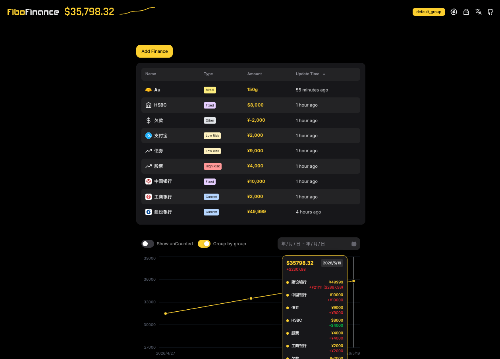

<p align="center">
  <br/>
  <picture>
    <source media="(prefers-color-scheme: dark)" srcset="./public/logo-dark.svg" width="60%">
    <source media="(prefers-color-scheme: light)" srcset="./public/logo-light.svg" width="60%">
    
  </picture>
  <br/>
  <br/>
  <p align="center">
    
    
    
  </p>
  
</p>

[English](./README.md) | [简体中文](./README_ZH.md)

FiboFinance is a lightweight, self-hosted asset tracking app: record assets, view trends and allocation, and get AI analysis when needed.

## Demo

https://fibofinance.cn

## Highlights

- Self-hosted, data-secure, and password-protected
- Supports group management
- Multi-currency support with custom exchange rates (silver, gold, and similar assets can be recorded by gram and automatically converted to CNY)
- Supports trend charts, allocation pie charts, and history records
- Supports AI analysis

## Deployment

One-click deployment on Vercel (not recommended, because it creates a brand-new repository instead of a fork)

[](https://vercel.com/new/clone?repository-url=https://github.com/emiyaaaaa/fibofinance)

Deploy on Vercel after forking the repository (recommended, because you can sync the latest code with one click)


Create a Neon database in Vercel


Deployment successful


Connect the database


Redeploy after connecting the database


Configure AI analysis (optional)


## Local Development

Configure `.env.local`

```bash
DATABASE_URL="postgres://..."
OPENAI_API_KEY="" # Optional
OPENAI_MODEL="" # Optional
OPENAI_BASE_URL="" # Optional
```

Start the app

```bash
npm install

npm run dev
```

## License

[MIT](./LICENSE)
